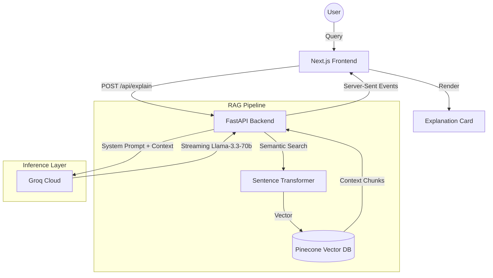

<div align="center">


# Prefrontal

**Evolutionary psychology explainer — trace modern fears to ancestral origins.**

*A high-fidelity RAG-powered platform designed to decode the biological legacy of our ancient brain using Groq LLMs and Pinecone vector search.*

[](https://fastapi.tiangolo.com/)
[](https://nextjs.org/)
[](https://groq.com/)
[](https://www.pinecone.io/)
[](LICENSE)

[**Installation →**](#installation)&nbsp;&nbsp;|&nbsp;&nbsp;[**Architecture →**](#architecture)&nbsp;&nbsp;|&nbsp;&nbsp;[**Tech Stack →**](#tech-stack)

</div>

---

## Overview

**Prefrontal** is your personal AI-powered companion for tracing modern anxieties, behaviors, and cravings back to their survival origins. Whether it's the paralyzing fear of social rejection (ancestral exile) or the irresistible urge for sugar (ancient scarcity), Prefrontal provides a clinical yet accessible explanation by bridging modern neuroscience with evolutionary biology.

**What makes this different:**
- **RAG-First Intelligence** — Every answer is grounded in curated evolutionary data and academic texts (Sapolsky, Dawkins, Lieberman).
- **Sub-100ms Inference** — Leverages **Groq's Llama-3.3-70b** for near-instantaneous streaming explanations.
- **Biometric UI** — A premium, glassmorphic interface designed with a clinical aesthetic and "neural" loading states.
- **Traceable Context** — Users can see exactly which survival patterns and academic sources were used to construct the explanation.

---

## Architecture



The system employs a **Retrieval-Augmented Generation (RAG)** architecture. When a user asks about a behavior, the backend performs a semantic search against a Pinecone index containing thousands of vectors from evolutionary psychology papers and curated survival patterns. This context is then piped into **Llama-3.3-70b** on Groq to generate a scientifically grounded response.

---

## Features

| Feature | Detail |
|---------|--------|
| **Streaming Explanations** | Real-time SSE streaming for instant feedback, even for complex queries. |
| **Semantic Knowledge Base** | Vector search across PDF books and curated seed data using BGE-base-en-v1.5. |
| **Neural Loader** | A custom-built CSS animation that visualizes "neural firing" during retrieval. |
| **Context Metadata** | Displays retrieval latency and the number of survival patterns analyzed. |
| **Cross-Platform Scripts** | One-click `.bat` scripts for Installation, Running, Testing, and Uninstallation. |
| **Suggestion Chips** | Pre-defined queries for common behaviors like "Sugar Cravings" and "Fear of the Dark". |

---

## Tech Stack

| Layer | Technology | Purpose |
|-------|-----------|---------|
| **Frontend** | Next.js 16 (App Router) | High-performance, SEO-friendly UI with React 19. |
| **Backend** | FastAPI (Python 3.11+) | Asynchronous API for low-latency RAG processing. |
| **LLM Engine** | Groq (Llama-3.3-70b) | Ultra-fast inference with 70B parameter precision. |
| **Vector DB** | Pinecone | Serverless vector index for semantic retrieval. |
| **Embeddings** | BAAI/bge-base-en-v1.5 | State-of-the-art local embeddings via Sentence-Transformers. |
| **Orchestration** | LangChain | Pipeline management for retrieval and LLM integration. |
| **Styling** | Vanilla CSS + JSX | Premium glassmorphic design without utility overhead. |

---

## Project Structure

```text
Prefrontal/
├── backend/                # Python FastAPI Service
│   ├── api/                # Route handlers and schemas
│   ├── llm/                # Groq/LangChain integration
│   ├── rag/                # Embedding and retrieval logic
│   ├── main.py             # Entry point
│   └── requirements.txt    # Python dependencies
├── frontend/               # Next.js Application
│   ├── src/app/            # App Router pages
│   ├── src/components/     # UI/Neural components
│   └── package.json        # Node dependencies
├── knowledge_base/         # RAG Source Materials
│   ├── books/              # PDF academic texts (ingested)
│   └── curated/            # JSON seed patterns
├── scripts/                # Ingestion and evaluation tools
│   ├── build_index.py      # Pinecone ingestion script
│   └── eval_rag.py         # Performance testing
├── install.bat             # One-click environment setup
├── run.bat                 # One-click project launch
└── test.bat                # Comprehensive test suite
```

---

## Installation

The project includes a robust automation suite to handle environment setup.

### Prerequisites
- [Python 3.11+](https://www.python.org/downloads/)
- [Node.js 18+](https://nodejs.org/)
- [Groq API Key](https://console.groq.com/)
- [Pinecone API Key](https://app.pinecone.io/)

### Quick Start
1. **Clone the repository:**
   ```bash
   git clone https://github.com/Ares19v/Prefrontal.git
   cd Prefrontal
   ```

2. **Configure Environment:**
   Create a `.env` file in the `backend/` directory based on `.env.example`.

3. **Automatic Installation:**
   Run the included installation script to set up the Python venv, install Node modules, and build dependencies.
   ```powershell
   ./install.bat
   ```

4. **Ingest Knowledge Base:**
   Populate your Pinecone index with the evolutionary knowledge base.
   ```powershell
   python scripts/build_index.py
   ```

5. **Run the Project:**
   ```powershell
   ./run.bat
   ```

---

## Configuration

| Variable | Description |
|----------|-------------|
| `GROQ_API_KEY` | Your Groq API key for Llama-3.3 inference. |
| `PINECONE_API_KEY` | Your Pinecone API key. |
| `PINECONE_INDEX_NAME` | The name of your serverless index (default: `prefrontal-knowledge`). |
| `GEMINI_API_KEY` | (Optional) Fallback key for Google Gemini models. |

---

## License

Distributed under the MIT License. See `LICENSE` for more information.

**Author:** [Ares19v](https://github.com/Ares19v)
